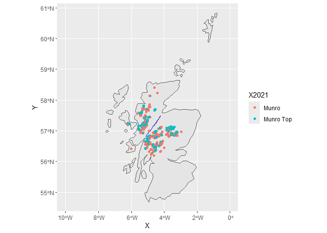

myprojectfile
================
Anna Harper
2025-11-25

``` r
library("tidytuesdayR")
```

    ## Warning: package 'tidytuesdayR' was built under R version 4.5.2

``` r
library("sf")
```

    ## Warning: package 'sf' was built under R version 4.5.2

    ## Linking to GEOS 3.13.1, GDAL 3.11.4, PROJ 9.7.0; sf_use_s2() is TRUE

``` r
library("tidyverse")
```

    ## ── Attaching core tidyverse packages ──────────────────────── tidyverse 2.0.0 ──
    ## ✔ dplyr     1.1.4     ✔ readr     2.1.5
    ## ✔ forcats   1.0.0     ✔ stringr   1.5.1
    ## ✔ ggplot2   3.5.2     ✔ tibble    3.3.0
    ## ✔ lubridate 1.9.4     ✔ tidyr     1.3.1
    ## ✔ purrr     1.1.0

    ## ── Conflicts ────────────────────────────────────────── tidyverse_conflicts() ──
    ## ✖ dplyr::filter() masks stats::filter()
    ## ✖ dplyr::lag()    masks stats::lag()
    ## ℹ Use the conflicted package (<http://conflicted.r-lib.org/>) to force all conflicts to become errors

``` r
library("dplyr")
library("tmap")
library("rnaturalearth")
```

    ## Warning: package 'rnaturalearth' was built under R version 4.5.2

``` r
library("ggplot2")

sf_use_s2(FALSE)
```

    ## Spherical geometry (s2) switched off

    ## ---- Compiling #TidyTuesday Information for 2025-08-19 ----
    ## --- There is 1 file available ---
    ## 
    ## 
    ## ── Downloading files ───────────────────────────────────────────────────────────
    ## 
    ##   1 of 1: "scottish_munros.csv"

    ## Reading 'ne_10m_lakes.zip' from naturalearth...
    ## Reading 'ne_10m_rivers_lake_centerlines.zip' from naturalearth...
    ## although coordinates are longitude/latitude, st_intersects assumes that they
    ## are planar
    ## 
    ## although coordinates are longitude/latitude, st_intersects assumes that they
    ## are planar

<!-- -->

``` r
munros_2021_df <- scottish_munros[
  !is.na(scottish_munros$`2021`) &
    !grepl("Top", scottish_munros$`2021`) &
    !is.na(scottish_munros$xcoord) &
    !is.na(scottish_munros$ycoord),
]
```

``` r
coords <- as.matrix(munros_2021_df[, c("xcoord", "ycoord")])

dist_obj <- dist(coords)
dist_mat <- as.matrix(dist_obj)

diag(dist_mat) <- NA

nearest_dist_m <- apply(dist_mat, 1, min, na.rm = TRUE)

munros_2021_df$nearest_munro_m <- nearest_dist_m
munros_2021_df$nearest_munro_km <- nearest_dist_m / 1000
```

``` r
most_remote <- munros_2021_df[which.max(munros_2021_df$nearest_munro_km), ]

most_remote
```

    ## # A tibble: 1 × 20
    ##   DoBIH_number Name     Height_m Height_ft xcoord ycoord `1891` `1921` `1933`
    ##   <chr>        <chr>       <dbl>     <dbl>  <dbl>  <dbl> <chr>  <chr>  <chr> 
    ## 1 1301         Ben More      966      3169 152576 733078 Munro  Munro  Munro 
    ## # ℹ 11 more variables: `1953` <chr>, `1969` <chr>, `1974` <chr>, `1981` <chr>,
    ## #   `1984` <chr>, `1990` <chr>, `1997` <chr>, `2021` <chr>, Comments <chr>,
    ## #   nearest_munro_m <dbl>, nearest_munro_km <dbl>

``` r
knitr::kable(
  most_remote,
  caption = "Most Remote Munro"
)
```

| DoBIH_number | Name | Height_m | Height_ft | xcoord | ycoord | 1891 | 1921 | 1933 | 1953 | 1969 | 1974 | 1981 | 1984 | 1990 | 1997 | 2021 | Comments | nearest_munro_m | nearest_munro_km |
|:---|:---|---:|---:|---:|---:|:---|:---|:---|:---|:---|:---|:---|:---|:---|:---|:---|:---|---:|---:|
| 1301 | Ben More | 966 | 3169 | 152576 | 733078 | Munro | Munro | Munro | Munro | Munro | Munro | Munro | Munro | Munro | Munro | Munro | NA | 54308.35 | 54.30835 |

Most Remote Munro
